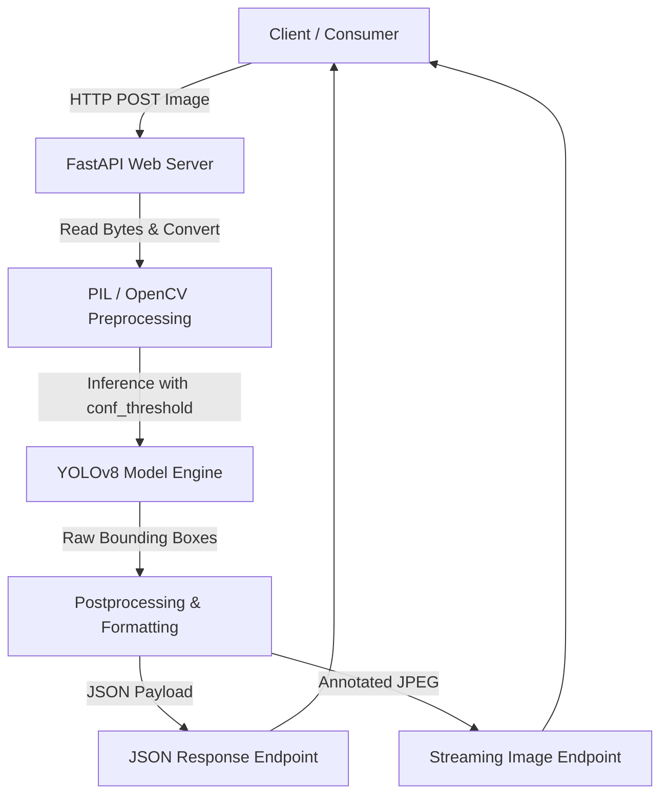

# YOLOv8 Object Detection API

[](https://fastapi.tiangolo.com/)
[](https://github.com/ultralytics/ultralytics)
[](https://www.docker.com/)
[](https://www.python.org/)

## The Problem: Deploying Computer Vision in Production is Painful

Getting a Computer Vision (CV) model to run on a local Jupyter notebook is easy. But moving it into production at scale is notoriously difficult:
* **Dependency Nightmares**: Discrepancies in system-level libraries (CUDA, OpenCV, PyTorch) between development and production cause failure at deploy time.
* **Tightly Coupled Architecture**: Forcing other microservices (often written in Node.js, Go, or Java) to execute Python scripts directly leads to fragile shell executions and massive resource overhead.
* **Scalability Bottlenecks**: Deep learning models consume heavy CPU/GPU resources and memory. Keeping them inside a main monolithic web application blocks the event loop and compromises reliability.

This repository provides the solution: a **production-ready REST API** that wraps the state-of-the-art **YOLOv8** model inside a highly performant **FastAPI** wrapper, fully containerized with **Docker**.

---

## Architecture Flow



Our architecture ensures a clean, decoupled design where any client can send raw image data and retrieve immediate predictions or annotated images via clean HTTP requests.

---

## Tech Stack

| Technology | Purpose | Key Benefit |
| :--- | :--- | :--- |
| **YOLOv8 (Ultralytics)** | Core CV Model | Fast, accurate real-time object detection with robust support for custom weights. |
| **FastAPI** | REST API Wrapper | Asynchronous support, low latency, automatic OpenAPI documentation, and easy serialization. |
| **Docker** | Containerization | Eliminates "works on my machine" issues by standardizing PyTorch, system dependencies, and OS settings. |
| **OpenCV & Pillow** | Image Manipulation | Highly optimized pre- and post-processing, bounding box rendering, and image conversion. |
| **Python** | Runtime Environment | Native ecosystem for machine learning and scientific libraries. |

---

## API Endpoints

All endpoints are self-documenting and interactive. Start the server and head to `http://localhost:8001/docs` to test them live.

| Method | Endpoint | Description | Query Parameters | Request Body | Response Format |
| :--- | :--- | :--- | :--- | :--- | :--- |
| `GET` | `/` | Documentation Redirect | None | None | Redirects to `/docs` |
| `GET` | `/health` | Production Health Check | None | None | `{"status": "healthy", "model": "YOLOv8", "version": "1.0.0"}` |
| `GET` | `/healthcheck` | Legacy Health Endpoint | None | None | `{"healthcheck": "Everything OK!"}` |
| `GET` | `/models` | Available Models Directory | None | None | List of path strings (e.g. `["sample_model/yolov8n.pt"]`) |
| `POST` | `/img_object_detection_to_json` | Metadata Detection | `confidence_threshold` (Default: `0.25`) | Multipart Form (`file`: Image) | JSON object containing bounding boxes, names, and confidences |
| `POST` | `/img_object_detection_to_img` | Annotated Output | `confidence_threshold` (Default: `0.25`) | Multipart Form (`file`: Image) | Binary stream of the annotated JPEG image |

---

## Quick Start & Deployment

### 🐳 Running via Docker (Recommended)

1. Clone this repository and navigate to the project directory:
   ```bash
   git clone https://github.com/KevinAi18/yolov8-detection-api.git
   cd yolov8-detection-api
   ```

2. Start the service using Docker Compose:
   ```bash
   docker-compose up --build
   ```
   The API will now be running at `http://localhost:8001`.

### 🐍 Running Locally

1. Install system requirements and Python dependencies:
   ```bash
   pip install -r requirements.txt
   ```

2. Launch the ASGI server with Uvicorn:
   ```bash
   uvicorn main:app --reload --host 0.0.0.0 --port 8001
   ```

3. Run the automated tests to verify the installation:
   ```bash
   pytest -v --disable-warnings
   ```

---

## Code Examples

### 1. Retrieve Detection Metadata (JSON)

```python
import requests

api_host = "http://localhost:8001/img_object_detection_to_json"
image_path = "test_image.jpg"

with open(image_path, "rb") as file:
    files = {"file": file}
    params = {"confidence_threshold": 0.50}
    response = requests.post(api_host, files=files, params=params)

print(response.json())
```
**Example Response Output:**
```json
{
  "detect_objects_names": "cat, dog",
  "detect_objects": [
    {"name": "cat", "confidence": 0.926},
    {"name": "dog", "confidence": 0.910}
  ]
}
```

### 2. Retrieve Annotated Image

```python
import requests
from PIL import Image
from io import BytesIO

api_host = "http://localhost:8001/img_object_detection_to_img"
image_path = "test_image.jpg"

with open(image_path, "rb") as file:
    files = {"file": file}
    params = {"confidence_threshold": 0.45}
    response = requests.post(api_host, files=files, params=params)

if response.status_code == 200:
    annotated_image = Image.open(BytesIO(response.content))
    annotated_image.show()
```

### 3. Run Batch Processing Programmatically

This repository includes a dedicated helper script `batch_detection.py` for aggregating results over multiple files.
```python
from batch_detection import batch_detect

images = ["test1.jpg", "test2.jpg"]
detections = batch_detect(images, api_host="http://localhost:8001/", confidence=0.40)

for img_path, result in detections.items():
    print(f"{img_path}: {result}")
```

---

## Architectural Deep-Dive

### Q: Why wrap a CV model in FastAPI instead of using it directly?

1. **Service Decoupling & Polyglot Architecture**: Microservices shouldn't be locked into Python just because of a machine learning component. An HTTP REST wrapper allows frontend apps, Go API gateways, Node.js aggregators, or Rust workers to communicate with the model seamlessly.
2. **Horizontal Scalability**: Inference is CPU and memory intensive. Placing the CV model in a separate microservice container allows you to scale it independently of your main application. If the main backend gets 10,000 req/sec but only 100 require image detection, you scale only the detection service, optimizing server costs.
3. **Optimized Event Loops**: Direct local model execution can block asynchronous servers. Running the inference pipeline in an isolated ASGI process (FastAPI + Uvicorn) ensures network operations and multi-threading models run optimally without event-loop starvation.
4. **Clean Resource Limits**: Operating systems can enforce strict CPU/RAM usage quotas on containers. Containing the model keeps a memory leak or memory spike from crashing the entire system. 
## API Usage 
 
Send a POST request to /detect with an image file to get back bounding boxes, class labels and confidence scores for each detected object. 
 
## Supported Tasks 
- Object detection 
- Instance segmentation 
- Pose estimation 
 
## Installation 
1. Clone the repository 
2. Install dependencies from requirements.txt 
3. Download pretrained YOLOv8 weights 
4. Run the FastAPI server with uvicorn 
